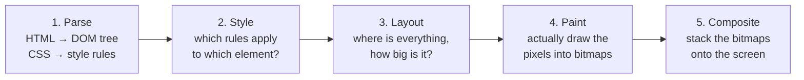
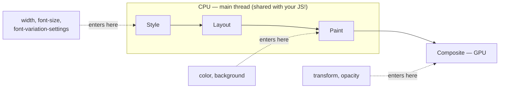
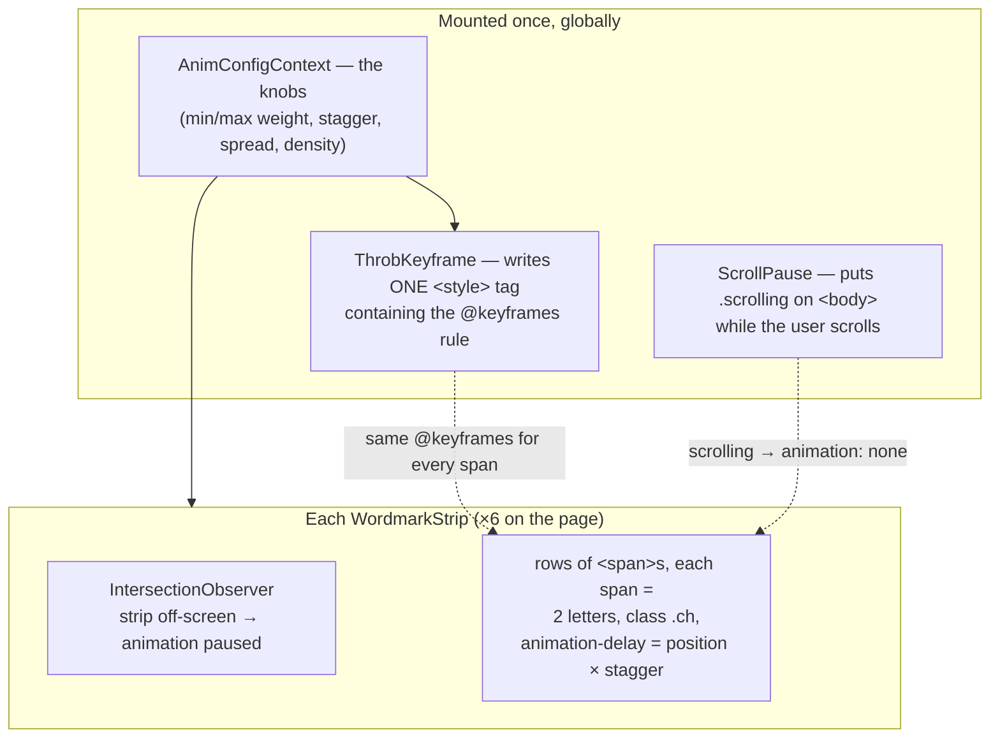

# How the throb animation works — from "what does a browser actually do" up

You know HTML/CSS/JS/React. This doc fills in the layer *below* that: what
the CPU and GPU each do to put your page on screen, why our animation was
expensive, and exactly what our two optimizations made the browser skip.

---

## 1. What happens between "here's some HTML" and "pixels on screen"

The screen is just a grid of pixels (a 1920×1080 monitor = ~2 million tiny
colored dots). *Everything* the browser does ultimately ends in: decide a
color for every pixel, 60 times per second. The journey looks like this:



In plain words:

1. **Parse** — read your HTML into the DOM (the tree React manipulates),
   read your CSS into a list of rules.
2. **Style** — for every element, figure out its final computed values:
   "this `<span>` ends up `font-size: 32px`, `color: #000`, `font-variation-settings: 'wght' 340`…"
3. **Layout** (also called *reflow*) — geometry. Where does each box sit?
   How wide is this text? If a word gets wider, everything after it has to
   move — layout is the step that figures all of that out. For text this
   includes **shaping**: computing the actual outline of every glyph and how
   far the pen advances before the next one.
4. **Paint** (also called *raster*) — take those positioned boxes and
   actually fill in pixels: draw this glyph's curves, fill this rectangle
   red. The output is bitmaps (finished images) held in memory.
5. **Composite** — take the finished bitmaps and stack them in the right
   order at the right positions, like laying photos on a table, and send the
   result to the monitor.

### Who does which step — CPU vs GPU

A **CPU** has a handful of fast, smart cores. It's good at *sequential,
branchy* work: running your JavaScript, walking trees, deciding things.
A **GPU** has thousands of tiny, dumb cores. It's good at *doing the same
simple math on millions of pixels at once*: "move this entire image 3px
left", "blend these two images at 50% opacity".

| Step | Runs on | Which thread |
|---|---|---|
| Your JS / React | CPU | **main thread** |
| Style | CPU | **main thread** |
| Layout (incl. text shaping) | CPU | **main thread** |
| Paint → bitmaps | CPU (helper "raster" threads, often GPU-assisted) | not the main thread |
| Composite | **GPU**, driven by the *compositor thread* | not the main thread |

Two things to burn in:

- **Steps 2–4 share one thread with your JavaScript.** If the browser spends
  10ms re-laying-out text, that's 10ms your click handlers, React renders,
  and scrolling logic cannot run.
- **The GPU never computes layout or draws text.** It only *re-arranges and
  blends bitmaps that already exist*. That's why it's nearly free — and why
  it can only help with effects that are expressible as "move/fade/scale an
  existing image".

### The frame budget

The screen refreshes ~60 times per second → the browser has **~16.7
milliseconds** to produce each frame. If steps 2–4 take longer than that,
the frame is late, the animation visibly stutters — that's "jank". All
animation performance work is really one question: *what fits in 16ms?*

---

## 2. What "animating a CSS property" really means

An animation is just: every frame, one property has a new value, and the
browser must re-run **every pipeline step that value affects**. Properties
fall into three tiers depending on where they enter the pipeline:



| You animate… | Browser must redo… | Why |
|---|---|---|
| `transform`, `opacity` | Composite only | The bitmap already exists; GPU just slides/fades it. Main thread does **nothing**. |
| `color`, `background` | Paint + Composite | Pixels change, but nothing *moves* — no geometry to recompute. |
| `width`, `font-size`, **`font-variation-settings`** | Layout + Paint + Composite | Geometry changed → re-measure, re-position, re-draw. The expensive tier. |

This is why every performance guide says "only animate transform and
opacity": those are the only two the GPU can handle alone while the CPU
stays free.

### Our animation is the worst tier, unavoidably

The throb animates the **weight axis of a variable font**. When `'wght'`
goes from 340 → 360, the CPU must:

1. recompute the actual curves of each glyph (a bolder Y is a *different
   shape*, not a scaled or recolored one),
2. recompute each glyph's width — bolder letters are **wider**, so every
   letter after it physically shifts (that "push" is exactly the effect that
   makes the animation feel alive),
3. re-rasterize the text into a fresh bitmap.

Shapes and positions change → the GPU's "slide an existing bitmap" trick is
useless. This cost is *inherent to the effect we want*. So the strategy
isn't "move it to the GPU" (impossible) — it's **make the CPU do that work
far less often, on far fewer elements.**

---

## 3. How the animation is built (the architecture)



The design is already smart in one big way: **zero JavaScript runs per
frame.** There's no `requestAnimationFrame` loop, no React re-renders during
the animation. One CSS `@keyframes` rule animates the weight; *every span
runs the identical animation*, and the traveling wave exists only because
each span starts at a different time (`animation-delay = its position ×
stagger`). The browser's own animation engine drives everything.

But: ~6 strips × up to ~20 rows × dozens of spans = **a few thousand
animated spans**, each forcing Layout + Paint on the main thread while
visible. That's where the cost was.

---

## 4. Optimization 1 — quantized keyframes (the `steps()` trick)

Here's the key browser behavior this exploits:

> Every frame, the browser computes the animated value. Then it **diffs**:
> *did the computed value actually change since last frame?* If no — it
> skips Layout and Paint entirely. The dirty work only happens on change.

A smooth keyframe (`100 → 900` with easing) produces a **different value
every single frame**, so the diff never gets to say "no":

```
frame:    1     2     3     4     5     6     7     8   ...
wght:     100   134   171   213   259   307   358   411  ← new value every frame
work:     S+L+P S+L+P S+L+P S+L+P S+L+P S+L+P S+L+P S+L+P   (Layout+Paint 60×/sec)
```

So in `ThrobKeyframe` we now generate the keyframes as **16 discrete stops**,
with `animation-timing-function: steps(1, end)` between them — meaning "hold
this exact value flat until the next stop, then jump". The ease-in-out curve
is baked into *which values* the stops hold:

```
frame:    1     2     3     4     5     6     7     8   ...
wght:     100   100   100   152   152   152   248   248  ← holds, then jumps
work:     S+L+P s     s     S+L+P s     s     S+L+P s       (s = cheap style tick only)
```

And the biggest part: each span's cycle is ~88% "rest" (sitting at minimum
weight waiting for the next wave). During that whole tail the value is
constant, so those spans cost **zero** Layout and Paint:

```
rest tail: s  s  s  s  s  s  s  s  s  s  s  s  ...   ← nothing to redraw
```

Why can't you see the difference? The jumps are ~50 weight units roughly
every 20ms. Film is 24fps (a new image every ~42ms) and looks smooth —
we're stepping twice as fast as cinema.

> **The transferable idea:** the browser charges you per *value change*,
> not per animation. If you must animate an expensive property, make it
> change in steps — you choose the frame rate of the expensive work instead
> of paying 60fps for it.

---

## 5. Optimization 2 — stop animating letters nobody can see

Each strip clips its rows with `overflow: hidden`, and each row is shifted
left a bit more than the one above (that's the diagonal pattern). The rows
were all built long enough for the *worst case* shift, plus 3 spare words:

```
              ┌────────── visible window (overflow: hidden) ──────────┐
row 0         │YUANGONGFUYUANGONGFUYU│ANGONGFUYUANGONGFUYUANGONGFU...
row 1       YU│ANGONGFUYUANGONGFUYUAN│GONGFUYUANGONGFUYUANGONGFU...
row 2     YUAN│GONGFUYUANGONGFUYUANGO│NGFUYUANGONGFUYUANGONGFU...
              └───────────────────────┘
                what you see              what was ALSO being animated,
                                          laid out and painted every frame
```

The trap: **`overflow: hidden` hides pixels, it does not skip work.** A
clipped span still gets its style computed, its glyphs shaped, its row
re-laid-out every time its weight changes. On the narrow Intro strips, rows
were ~60 characters long when the window can only ever show ~22.

The fix is in `WordmarkStrip`: each row now stops rendering spans at its own
visible window (strip width + that row's shift, plus one spare word as a
safety margin). The animation delays still use each character's absolute
position, so the wave looks identical — there are simply **30–45% fewer
spans paying the per-frame tax**.

> **The transferable idea:** the browser charges per *element*, too. Before
> optimizing how something animates, check whether everything animating
> actually needs to exist.

---

## 6. The supporting cast (already in place, worth understanding)

- **`contain: layout style paint`** on each strip — a promise to the
  browser: "changes inside this box can't affect anything outside it."
  Without it, a layout change *might* ripple page-wide, so the browser must
  check; with it, recalculation stays inside the strip.
- **IntersectionObserver → `animation-play-state: paused`** — strips you've
  scrolled past pause completely. The single biggest lever for any animated
  page: the cheapest frame is the one you don't produce.
- **`.scrolling` on `<body>` → `animation: none`** — while you scroll, the
  main thread is needed for scrolling itself; the animations get out of the
  way entirely and snap back to rest weight on resume (no flash, thanks to
  `animation-fill-mode: backwards`).
- **`prefers-reduced-motion`** — OS-level "less motion please" setting now
  disables the animation. Accessibility, plus free performance for those
  users.

---

## 7. Your playbook for future custom animations

1. **Choose the property before designing the effect.** Can it be expressed
   as moving/scaling/fading something that already looks right? Use
   `transform`/`opacity` → GPU does it, main thread free, done.
2. **Must touch layout** (text weight, width, line breaks)? Then:
   quantize with `steps()` · animate fewer elements · `contain` the damage ·
   pause off-screen · pause during scroll.
3. **Prefer CSS animations/`@keyframes` over a JS loop.** Our wave of
   thousands of letters uses *zero* per-frame JavaScript — delays on a
   shared keyframe do everything. A `requestAnimationFrame` loop writing
   styles pays JS cost *plus* style recalc, every frame.
4. **Thousands of moving things → leave the DOM, use `<canvas>`.** Canvas
   skips Style/Layout per element entirely; you just draw pixels once per
   frame. (Lesson from our own reverted experiment: a canvas inside a Web
   Worker doesn't inherit the page's fonts — load them manually with
   `FontFace` + `self.fonts.add()`, or your text silently renders in the
   wrong font.)
5. **See it with your own eyes** — open DevTools on this site:
   - **Performance panel** → record 5s → purple blocks = Layout, green =
     Paint. Compare the density of purple before/after our change
     (`git stash` the change to flip back temporarily).
   - **Cmd/Ctrl+Shift+P → "Show Rendering"** → check **Paint flashing**:
     green rectangles flash on every repaint. Watch the strips blink at each
     weight step — and nothing blink during the rest phase.
   - Same Rendering tab → **Frame rendering stats** for a live FPS meter.

---

*Companion diagram: `animation-pipeline.excalidraw` — open at
excalidraw.com or with the VS Code Excalidraw extension. The Mermaid
diagrams above render on GitHub, or in VS Code with the "Markdown Preview
Mermaid Support" extension.*
